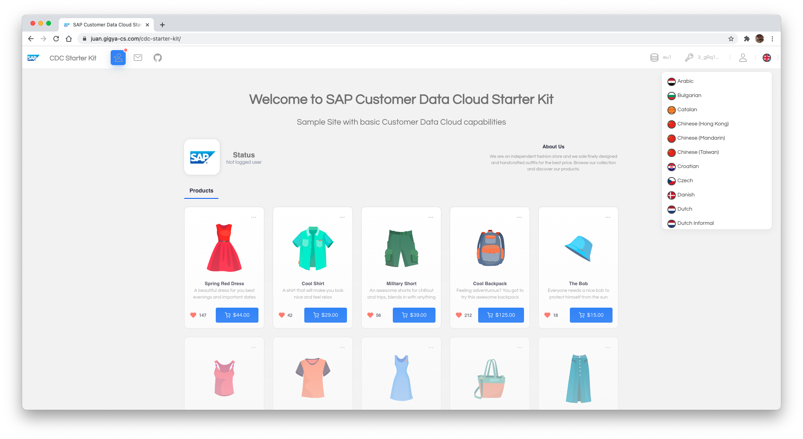
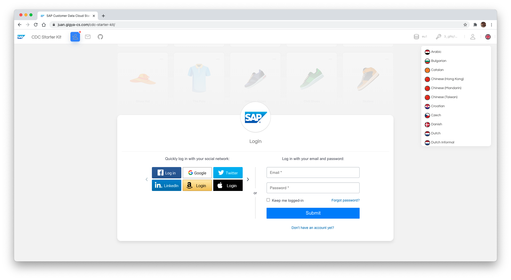

# **SAP Customer Data Cloud Starter Kit**
#### **{**HTML + CSS + JS**}**

SAP Customer Data Cloud (SAP CDC) Starter Kit is a simple front-end template for building
fast, robust, and adaptable web apps or sites, including SAP CDC capabilities.

The project includes a demo website with the most common user flows, like registration, login, profile update, reset password, etc. All these flows are offered OOTB using SAP Customer Data Cloud [Screen-Sets]([https://developers.gigya.com/display/GD/Screen-Sets](https://help.sap.com/docs/SAP_CUSTOMER_DATA_CLOUD/8b8d6fffe113457094a17701f63e3d6a/416fc0d470b21014bbc5a10ce4041860.html)), and only using **HTML**, **CSS** and **JS**.

* Homepage: [https://github.com/gigya/cdc-starter-kit](https://github.com/gigya/cdc-starter-kit)
* Source: [https://github.com/gigya/cdc-starter-kit](https://github.com/gigya/cdc-starter-kit)

## Quick start

Follow the [Installation Guide](docs/install.md) to have this demo running in less than 10 minutes.

Can't wait? Check out our [demo site](https://gigyademo.com/cdc-starter-kit/)!

 <!--  -->

 
 

## Included Flows

The included flows in the demo are:

| Flow | Description |
|-|-|
| Registration | A [Full Registration](https://help.sap.com/docs/SAP_CUSTOMER_DATA_CLOUD/8b8d6fffe113457094a17701f63e3d6a/416fc0d470b21014bbc5a10ce4041860.html#registration-flows) user flow, which creates a user in Gigya.|
| Login | [Login](https://help.sap.com/docs/SAP_CUSTOMER_DATA_CLOUD/8b8d6fffe113457094a17701f63e3d6a/416fc0d470b21014bbc5a10ce4041860.html#registration-flows) capabilities for created users in Gigya. |
| Update Profile | Once logged, you have the screens used when [updating](https://help.sap.com/docs/SAP_CUSTOMER_DATA_CLOUD/8b8d6fffe113457094a17701f63e3d6a/4150730070b21014bbc5a10ce4041860.html) a user profile. |
| Email / Code Verification | Performs email / code verification inside the registration flow. To be [enabled](https://help.sap.com/docs/SAP_CUSTOMER_DATA_CLOUD/8b8d6fffe113457094a17701f63e3d6a/4139d66d70b21014bbc5a10ce4041860.html) in Gigya console. |
| Reset Password | Link to get a [Reset Password](https://help.sap.com/docs/SAP_CUSTOMER_DATA_CLOUD/8b8d6fffe113457094a17701f63e3d6a/50ea527441844c589fd1731116fc079d.html) email whenever a user chooses to reset their password. The link is valid for 1 hour by default.|
| Change Password | Once logged in, link to [change](https://help.sap.com/docs/SAP_CUSTOMER_DATA_CLOUD/8b8d6fffe113457094a17701f63e3d6a/4139d66d70b21014bbc5a10ce4041860.html) the current user password. |
| Consent | Test Gigya [Consent](https://help.sap.com/docs/SAP_CUSTOMER_DATA_CLOUD/8b8d6fffe113457094a17701f63e3d6a/414efcc570b21014bbc5a10ce4041860.html) features with very few steps and checks them inside the console. |
| Subscriptions / Lite Registrations | No password involved. Used typically for subscriptions, and any flow where only an email address is required, such as competition sign-ups, unlocking restricted content, voting, etc. For more information, see [Lite Registration](https://help.sap.com/docs/SAP_CUSTOMER_DATA_CLOUD/8b8d6fffe113457094a17701f63e3d6a/4162dc4a70b21014bbc5a10ce4041860.html). |
| Social Login | Login with Facebook, Google, Apple, Twitter, LinkedIn, etc..., and create a Gigya account with the data obtained from that [Social Provider](https://help.sap.com/docs/SAP_CUSTOMER_DATA_CLOUD/8b8d6fffe113457094a17701f63e3d6a/4172d0a670b21014bbc5a10ce4041860.html). |
| Link Accounts | With social accounts, enable [Linking](https://help.sap.com/docs/SAP_CUSTOMER_DATA_CLOUD/8b8d6fffe113457094a17701f63e3d6a/41627d4a70b21014bbc5a10ce4041860.html) feature to merge them into a single one, associated with two identities, rather than maintaining two separate accounts. |

#### Features

Global features (Cross-flow capabilities):

<!---
| Registration Completion |  |
| TFA | |
| Concatenate Screensets | Split your form into several to improve the user experience. See [doc](). |
-->

| Feature | Description |
|-|-|
| i18n | Set the [language](https://help.sap.com/docs/SAP_CUSTOMER_DATA_CLOUD/8b8d6fffe113457094a17701f63e3d6a/4141d83470b21014bbc5a10ce4041860.html) of your screensets. |
| Captcha | Add [CAPTCHA](https://help.sap.com/docs/SAP_CUSTOMER_DATA_CLOUD/8b8d6fffe113457094a17701f63e3d6a/4144cd9670b21014bbc5a10ce4041860.html) to your screensets to protect them against automated scripts. |
| Events | Execute actions after a successful login, after screen is loaded, or before submitting elements. Full list of available events [here](https://help.sap.com/docs/SAP_CUSTOMER_DATA_CLOUD/8b8d6fffe113457094a17701f63e3d6a/41532ab870b21014bbc5a10ce4041860.html). |
| Extensions | Add [Extensions](https://help.sap.com/docs/SAP_CUSTOMER_DATA_CLOUD/8b8d6fffe113457094a17701f63e3d6a/4153ec2f70b21014bbc5a10ce4041860.html) to control or enrich your flows serverside. |

## Requirements

1. Gigya Console access with Create Site capabilities.

1. Web server. (Apache, ngix, etc.)

## Documentation

Take a look at the [Basic Guide](docs/basic.md) to understand how to configure and customize your project. If you want to go deeper and understand the implementation basics, please go to the [Advanced Guide](docs/advanced.md), where you will find these and many other details.

This documentation is bundled with the project, making it available for offline reading and provides a useful starting point for any documentation you want to write about your project.

All relevant code (html, js, and css/less) is commented internally, so it can help developers understand how it was done and make it easier to integrate with other projects.

## Additional Gigya Links

Please follow this [link](docs/links.md) to find more related SAP CDC documentation about the configuration/enhancement of this site.

## Browser support

* Chrome *(latest 2)*
* Edge *(latest 2)*
* Firefox *(latest 2)*
* Internet Explorer 11
* Opera *(latest 2)*
* Safari *(latest 2)*

*This doesn't mean that Gigya Starter Kit cannot be used in older browsers,
just that we'll ensure compatibility with the ones mentioned above.*

## Troubleshooting

If you find yourself running into issues during installation or running the web application, please send an email to any contributors. We would be happy to discuss how they can be solved.

## License

This project is licensed under the [MIT License](http://www.apache.org/licenses/LICENSE-2.0), Copyright (c) 2021 SAP-CDC. For more information, see `LICENSE.md`.
