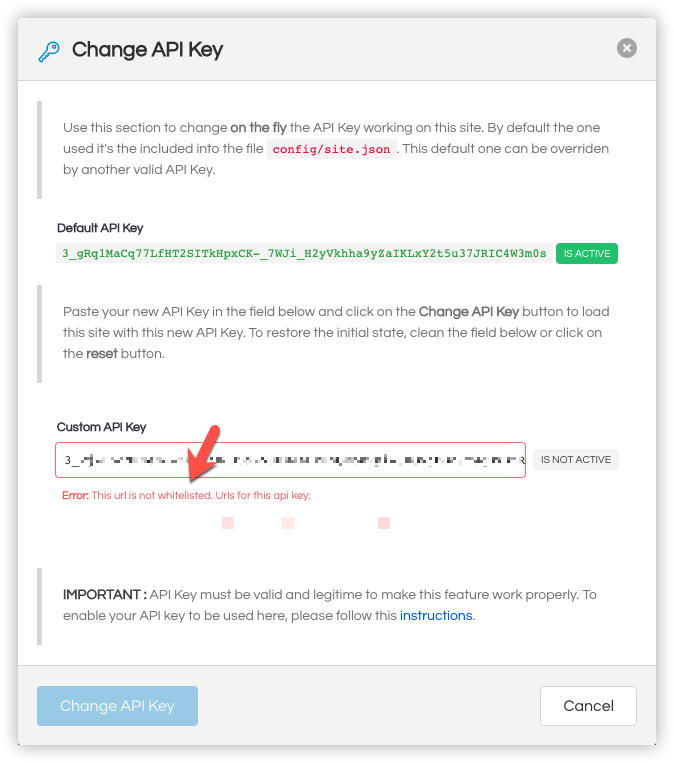
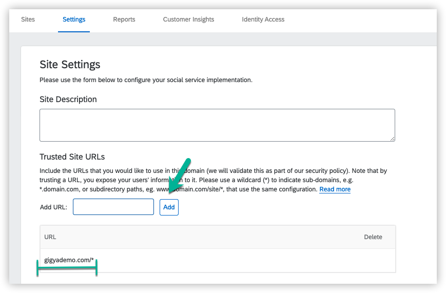
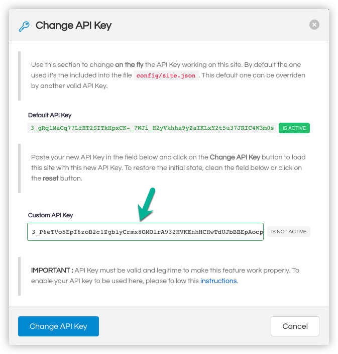

## Advanced Guide

This guide explains how this project is structured, how it works, the main technologies used, and some basics about its HTML.

It's highly recommended to read the [Basic Guide](basic.md) before starting with this tutorial.

## 1. Project Structure

This section shows the project file structure with a brief explanation of the main folders and files. Below, the files in a tree view:

```
├── config
│   ├── site.json
│   └── languages.json
|
├── css
│   ├── demo.css
│   └── lib
│       ├── bulma-social.min.css
│       └── core.min.css
|
├── docs
│   ├── advanced.md
│   ├── basic.md
│   ├── img/*
│   ├── install.md
│   └── links.md
|
├── html
│   ├── consents
│   │   ├── deletion.html
│   │   ├── privacy.html
│   │   └── tos.html
│   ├── facebook
│   │   └── channelURL.html
│   ├── sample-content
│   │   └── ecommerce.html
│   └── skeleton
│       └── navbar.html
|
├── img/*
|
├── js
│   ├── engine.js
│   ├── ui.js
│   ├── utils.js
│   ├── gigya-raas.js
│   ├── dynamic-apikey.js
│   └── main.js
|
├── less
│   ├── demo.less
│   └── src
│       ├── framework.less
│       └── lib
│           ├── classes.less
│           ├── gigya.less
│           ├── layout.less
│           └── variables.less
|
├── CONTRIBUTING.md
├── LICENSE.txt
├── NOTICE.txt
├── README.md
├── index.html
└── edit-profile.html

```


1. __config__: Folder for the configuration files. You can configure the site behavior and sources, as well as the languages in the dropdown.

2. __css__: The generated css files used in the project.
3. __docs__: This set of docs.
4. __html__: Main HTML content of the site. The navigation bar and logged sample content it's stored here.
5. __img__: It contains all the images for the project.
6. __js__: It contains the files with the logic of the site. It has a specific file for Gigya functions (gigya-raas.js), and other set of files  to make the site demo work (like engine.js or ui.js), and a last one (main.js), that will start all the process.
7. __less__: All style files are automatically generated using these less files as source. Using a proper plugin, any modification over these files will generate a new css set of files in the /css folder.
8. __index.html__: This is the main page of the site. It contains all the elements needed to manage both logged and not logged states for the user.
9. __edit-profile.html__: The edit profile page. This page will be shown only for logged in users, being redirected to the index.html page when the user's session is not present.
10. __Other files__: The rest of the files are or README files, or editor configuration files, like the .eslintrc.js. Git files are also there, and they can all be removed, and the project will work as expected.


## 2. How it works

This project is a simple HTML + JS + CSS project, although it has some libraries that empower/enhance the standard web capabilities. In this section we detail all of them.
### 2.1. HTML

This is what we call "One Page Application" meaning that all interactions will occur under the same page: ```index.html```. The control of the status it's stored and calculated each time using the javascript engine, re-painting in the screen the elements depending on if we are logged or not.

##### 2.3.1 CONTROL CLASSES
Two classes are controlling this fact: ```not-logged```and ```logged```. The main containers on the site have one or another class. The ```logged```elements are initially hidden.

##### 2.3.2 NAVBAR TEMPLATE
Located in ```html/skeleton.navbar.html```. It contains all the html related to the Navigation bar on top of the website. The control classes ```not-logged```and ```logged``` decide here as well which items are painted. This is the element with more Gigya interactions, as it contains links to the most common operations, as well as some information about the user (if it is logged in). The content of the navbar is:


```html
    <template>

        <!-- Brand -->
        <div class="navbar-brand">

            <div class="navbar-start not-logged">
                <!-- NOT LOGGED SECTION -->
            </div>

            <div class="navbar-start logged is-hidden">
                <!-- LOGGED SECTION -->
            </div>

            <!-- Nav Bar  MOBILE-->
        </div>

        <!-- Menu -->
        <div class="navbar-menu">
            <div class="navbar-end">
                <!-- System Info (Datacerner and API Key) -->

                <div class="navbar-item not-logged">
                    <!-- NOT LOGGED SECTION -->
                </div>

                <div class="navbar-item logged is-hidden">
                    <!-- LOGGED SECTION -->
                </div>

            <!-- HTML Dropdown For Languages... -->
        </div>
    </template>
```


1. *Logo and Site Description*: Configured in ```'./config/site.json'```. It shows the info of the site.

2. *Action items*: Some links with actions, like register, subscribe to newsletter, etc.
3. *Site info*: Datacenter and API Key of the site.
4. *User Info*: Shows user photo and identity providers of the logged user. An anonymous user (link to the login) it's shown otherwise.
5. *Language Switcher*: Dropdown to select the languages of the site. They are stored in ```localStorage``` in the browser, and they change the language of the screensets.


##### 2.3.3 INDEX PAGE

This page is the main page of the website. The control of the status is stored and calculated each time using the javascript engine, re-painting in the screen the elements in function of we are logged or not, using the control classes ```not-logged```and ```logged```.

When the user is logged in, and inside the main container of the ```index.html``` page, some dummy content simulating an e-commerce site is loaded into the main container with JavaScript.

The navigation bar and the sample content are _injected_ using the [handlebars](https://handlebars.org) library, in order to do the code more readable. This is the basic (and simplified) structure of the ```index.html``` page:


```html
<html>
    <head>
        <!-- ... all basic headers and imports ... -->
    </head>

    <body>
        <section class="hero ...">

            <!-- 0. Nav Bar -->
            <div id="main-navbar" class="...">
                <div class="container ...">

                    <!-- Navbar HTML content loaded dynamically and included in html/skeleton/navbar.html -->

                </div>
            </div>

            <!-- 1. Page Content -->
           <div class="hero-body">
               <div class="container">
                    <div class="...">

                    <!-- 1.1. Site Info -->

                            <section class="header not-logged">

                                <!-- HTML Content for Site Title NOT logged ... -->

                            </section>

                            <section class="header logged is-hidden">

                                <!-- HTML Content for Site Title logged ... -->

                            </section>

                    <!-- 1.2 Main page content-->

                            <div class="box not-logged">

                                <!-- HTML Content for Site Title Not logged ... -->

                            </div>

                            <div class="sample-content logged is-hidden">

                                <!-- HTML Content for Site Title logged ... -->

                                <!-- It will be substituted by the content in html/sample-content/-->
                            </div>
                    </div>
                </div>
            </div>
        </section>

        <!-- ...The rest of javascript files...  -->

    </body>
</html>

```
> **PRO TIP:** All ```logged``` classes are ```hidden``` classes as well in each load of the page, and they are removed once we detect the user is logged via javascript.


The ```edit-profile.html``` page it's very similar to this one, except for the fact that it hasn't ```non-logged``` elements, because it's a protected page. In case you try to access it without a session, you will be redirected to the login process again.

### 2.2. JavaScript
The project uses vanilla javascript  for all their interactions, although it uses [handlebars](https://handlebars.org) as template engine to simplify the pages and make them more meaningful. There are three main files that manage all the website:

1. **gigya-raas.js**: This file contains all typical gigya functions in a RaaS process. You will find here the triggers for the login, the registration, or the reset password process. __This is the file you want to copy in your project to have a set of default gigya functions__.

1. **dynamic-apikey.js**: This file contains some specific logic to be able to switch between api keys in realtime. __This file is not needed for a regular gigya implementation__, although it's interesting to understand how to load dinamically Gigya api keys into a site.

1. **ui.js**: This file contains all the logic related to the UI stuff, like re-painting the screen, dealing with popups, etc.

1. **utils.js**: This file contains several standard util functions.

1. **engine.js**: This file contains all the logic needed to make the site work. All these core functions, like managing the sessions, dealing with products, etc., are included in this file.

1. **main.js**: This file contains the main method of the site, initiated by standard Javascript, and the Gigya trigger ```onGigyaServiceReady```. When present, this function is triggered automatically once Gigya it's fully loaded (in ```index.html```). 

The```initDemoSite``` function (inside ```js/engine.js```), reads the configuration file placed into (```config/site.json```) and take the values to initialize the site, **initializing the Gigya WebSDK as part this process**.

Once Gigya it's fully loaded, it continues with the rendering of the page, showing the proper elements depending on if we are logged in or not.

You can see the code of these function in the [Basic Guide](https://github.com/gigya/cdc-starter-kit/blob/master/docs/basic.md#3-basic-behavior).


> **DISCLAIMER**: This framework doesn't pretend to be a good example / good practice for a real website. The objective here is to learn how Gigya works. Therefore aspects like security, UX, speed, responsivity, etc., are far from ideal.
>
> Please, use your own web technology when integrating Gigya, and think of this as a simplification of a real use case.

### 2.3. Styles
Although it uses css at the end, the project styles are built using [less](https://lesscss.org), generating a file called ```demo.css```, which is the one used in the main web pages of the app: ```/ìndex.html``` and ```èdit-profile.html```.

Apart from that, the project uses some external CSS libraries to enhance/improve the project look and feel:

1. **Bulma CSS Framework**:  Simple, elegant, and modern CSS framework. [Link](https://bulma.io/).

1. **Bulma Social Buttons**: Social Buttons and Colors for Bulma. [Link](https://aldi.github.io/bulma-social/).
1. **Friendkit**: Social Media UI Kit. [Link](https://themeforest.net/item/friendkit-social-media-ui-kit/24621825?irgwc=1&clickid=XyNzMA1WgxyLUPTwUx0Mo3EoUkEy6pS0t0%3A5So0&iradid=275988&irpid=1288816&iradtype=ONLINE_TRACKING_LINK&irmptype=mediapartner&mp_value1=&utm_campaign=af_impact_radius_1288816&utm_medium=affiliate&utm_source=impact_radius).
1. **Flag Icons**: A collection of all country flags in SVG — plus the CSS for easier integration. [Link](https://github.com/lipis/flag-icon-css).
1. **Hints CSS**: A pure CSS tooltip library. [Link](https://kushagra.dev/lab/hint/).
1. **IonIcons**: Premium designed icons for use in web, iOS, Android, and desktop apps. [Link](https://ionicons.com/v4/).
1. **Fonts**: _Roboto_ and _Questrial_ fonts added.

## 3. Use your own API key in the online demo site.

This is a hidden gem!! You can test your own API key in the online demo site without the need of downloading the project and install it locally.

Isn't that awesome? Yes, but first you need to enable this API key to be used in the demo site.


Access the feature clicking over the api key section in the navbar, and then, add a valid api key to be used. 

 


To whitelist your url, go to your Settings inside Gigya Console, and add this url to your **trusted urls** section:

- ```gigyademo.com/*```




After that, wait few minutes (between 5-120 mins) to have these changes available for that API key.




From that moment, this API key will be valid to be used inside the https://gigyademo.com/cdc-starter-kit, using the Dynamic load capability.


Enjoy!!


## 4. What else.

Although the site it's fully functional, there is still much more content to cover. If you want to know how to enhance/ extend the capabilities of this site, with elements like Captcha, Events, Registration Completion, Extensions, to understand how to integrate consents, etc., take a look at the [Links Page](links.md), where you will find how to implement many of these improvements.
