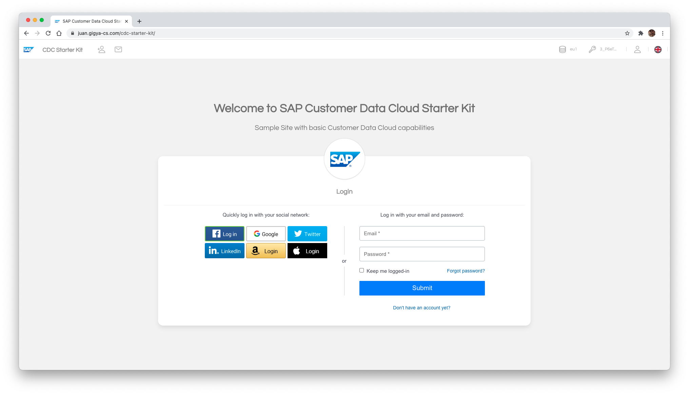
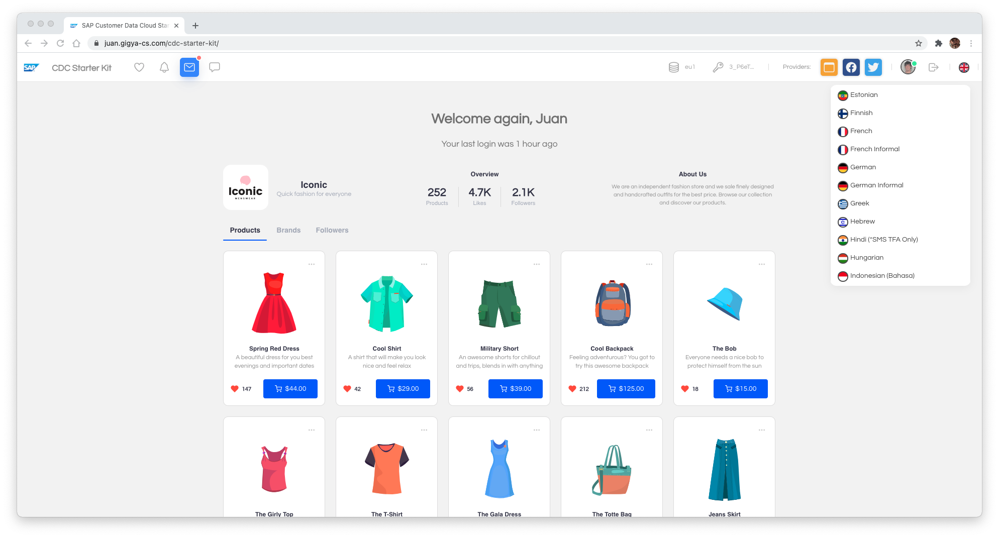

# Basic Usage

In this guide, we will explain how to configure this demo website to support the basic features that Gigya offers using the web SDK and the Screensets, and with some configuration in the console.

## 1. Project Overview

This project is a Simple Page Application (except for the edit-profile page, only for logged users) where the user will be in two different states: __logged__ or __not logged__, and the content rendered will be selected in function of these.

| Not Logged | Logged |
|-|-|
||


The navigation bar will reflect the user's current status (if it is logged or not), showing different elements for each case.

All Gigya related links are fully functional, allowing us to register, login, edit the profile, and in general, interact with Gigya WebSDK. When logged in, a list of the user's identity providers is shown in the navigation bar.


## 2. Configuration of the project

The API key, screensets Id, title, logo, and descriptions for the website are set, modifying the ```config/site.json``` and refreshing the page.

You can also customize some basic aspects of your website's look and feel, like the background, the colors of the links, text colors, and background for the navigation bar.

Note that some properties, like _apiKey_, _raas_prefix_, or _lang_, need to be correctly set to have the website properly working. Included properties are:


| Name | Description |
|-|-|
|```site_title```|Site Title (For the main page)
|```site_description```|Site Title (For the main page)
|```menu_description```|Description for the top menu in the navbar
|```menu_bg_color```|Background color for the navbar
|```menu_bg_color_hover```|Background color for the links in the navbar when hovered
|```menu_text_color```|Color for the text of the items in the navbar
|```text_color```|Color for the main text in the site
|```background_color```|Background color of the site
|```menu_pic```|Menu picture for the site (in the navbar)
|```main_url```|Main url of the site (for redirections and proper linking)
|```main_pic```|Main picture for the site
|```raas_prefix```|Gigya Prefix for the screensets
|```lang```|Default Language
|```apikey```|API Key of the site (obtained from the console. Read [here](https://github.com/gigya/cdc-starter-kit/blob/master/docs/install.md#1-create-site-in-gigya-console))


Here you can find an example of this file:

```json
{
    "menu_description": "CDC Starter Kit",
    "site_title": "SAP Customer Data Cloud Starter Kit",
    "site_description": "Sample Site with basic Customer Data Cloud capabilities",
    "menu_bg_color": "white",
    "menu_bg_color_hover": "#1d87ff2a",
    "menu_text_color": "#999",
    "text_color": "#7a7a7a",
    "background_color": "#f4f4f4",
    "menu_pic": "sap.png",
    "main_url": "https://gigyademo.com/cdc-starter-kit/",
    "main_pic": "sap.png",
    "raas_prefix": "Default",
    "lang": "en",
    "apiKey":"3_gRq1MaCq77LfHT2SITkHpxCK-_7WJi_H2yVkhha9yZaIKLxY2t5u37JRIC4W3m0s"
}
```

## 3. Basic behavior

The site loads a function called **initDemoSite()**, which reads the configuration file and loads Gigya script dinamically using javascript, using the API Key given in that file.

```javascript
document.addEventListener("DOMContentLoaded", function() {

    /* Load Configuration from setup/site.json and starts the site UI */
    initDemoSite();

});
```


After Gigya is fully loaded, the [onGigyaServiceReady](https://developers.gigya.com/display/GD/onGigyaServiceReady+Template) function is triggered automatically. This function asks for a valid Gigya session in the browser. If the session is valid (we are logged in), we show the protected elements for the user, and some basic information, like the name and the photo (if set).

If, on the contrary, the user is not logged in, the screen shows the login form, and remove all the protected elements from the screen. All this logic is implemented the **initPage()** method.

```javascript
function onGigyaServiceReady() {

    // Check if the user was previously logged in
    if (typeof gigya === 'undefined') {

        alert('Gigya is not loaded on this page :(');

    } else {

        // Check if the library is properly loaded or not (stops the all flows if it's bad loaded)
        checkIfGigyaLoaded();

        // Get Information about the user, and start the load of the page elements
        gigya.accounts.getAccountInfo({ include: 'profile, data, preferences', callback: initPage });

    }
}
```

These two main functions are implemented inside the file ```js/main.js```.


##### Edit profile page
Although the site is designed as a __Single Page Application__ (located in ```/index.html```), and just to show how to redirect to a different page only when logged in, the edition of the profile was separated into a different page, called ```/edit-profile.html```.

We can see the Update Profile form for the logged user on this page, where we can edit some information and store it again in Gigya. This is a protected page, meaning that if the user is not logged and try to access it, it will be redirected to the ```/ìndex.html``` page to re-login or register a new user.

## 4. Next steps

If you want to know how to enhance/ extend this site's capabilities, with elements like the structure, how it works, details about the styles, etc., read the [Advanced Guide](advanced.md).
