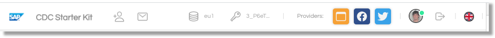

# Basic Usage

In this guide we will explain how to configure this demo website to support the basic features that Gigya offers using the webSdk and the Screensets + Configuration in the console.

## 1. Project Overview

This project is a Simple Page Application (except for the edit-profile.page, only for logged users) where the user will be in two different states: __logged__ or __not logged__, and the content rendered will be selected in function of these.

| Not Logged | Logged |
|-|-|
||


The navigation bar will reflect the current status of the user (if is logged or not), showing different elements for each case.

All gigya related links are fully functional, allowing us to register, login, edit the profile, and in general, interact with Gigya WebSDK. When logged in, a list of the Identity Providers of the user it's shown in the navigation bar.




## 2. Configuration of the project (config.json)

The title, logo, and descriptions for the website can be easily set modifying the ```config/config.json``` and refreshing the page.

You can customize as well some basic aspects of the look and feel for your website, like the background, the colors of the links, or the colors and background for the navigation bar.

Note that there are some properties lke _raas_prefix_, or _lang_, that they need to be correctly set in order to have the site properly working.

The include properties are:

| Name | Description |
|-|-|
|```site_title```|Site Title (For the main page)
|```site_description```|Site Title (For the main page)
|```menu_description```|Description for the top menu in the navbar
|```menu_bg_color```|Background color for the navbar
|```menu_bg_color_hover```|Background color for the links in the navbar when hovered
|```menu_text_color```|Color for the text of the items in the navbar
|```text_color```|Color for the main text in the site
|```background_color```|Background color of the site
|```menu_pic```|Menu picture for the site (in the navbar)
|```main_url```|Main url of the site (for redirectiions and proper linking)
|```main_pic```|Main picture for the site
|```raas_prefix```|Gigya Prefix for the screensets
|```lang```|Default Language


Here you can find an example of this file:

```
{
    "menu_description": "CDC Starter Kit",
    "site_title": "SAP Customer Data Cloud Starter Kit",
    "site_description": "Sample Site with basic Customer Data Cloud capabilities",
    "menu_bg_color": "white",
    "menu_bg_color_hover": "#1d87ff2a",
    "menu_text_color": "#999",
    "text_color": "#7a7a7a",
    "background_color": "#f4f4f4",
    "menu_pic": "sap.png",
    "main_url": "https://juan.gigya-cs.com/cdc-starter-kit/",
    "main_pic": "sap.png",
    "raas_prefix": "Default",
    "lang": "en"
}

```
If your screensets in the console are like "Default-RegistrationLogin" or "Default-UpdateProfile", then this file will work for the project without any modifications.

## 3. Features:

1. Registration
2. Login
3. Update Profile
4. Email Verification
5. Reset Password
6. Change Password
7. Subscribe
8. Consent
9. Lite Registration
10. Passwordless login. (Phone Login)
11. Social Login
12. Linking accounts

## 3. Project Structure
_WIP_

## 4. What else.

If you want to know how to enhace/ extend the capabilities of this site, with elements like Captcha, Events, Extensions, etc, read the [Advanced Guide](docs/advanced.md).
