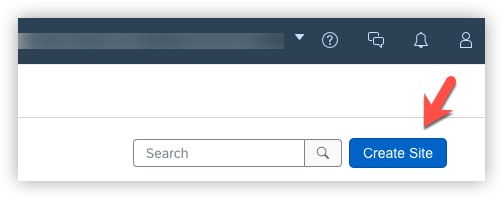
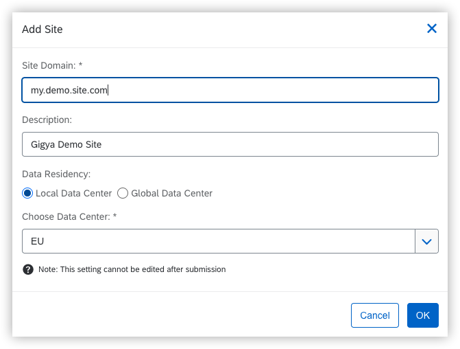
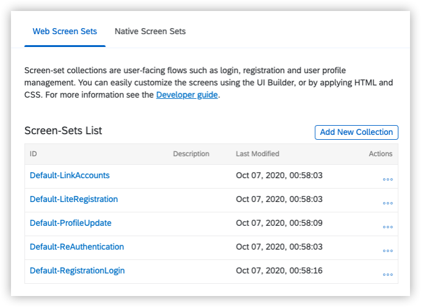

# Installation Guide


## 1. Create site in Gigya console


> <span style="color:green">**NOTE:** (You can skip this step if you already have a site configured and the API Key ready to use.)</span>

   1. Access your Gigya Console from [https://console.gigya.com]() with your credentials.


   2. If you have site creation capabilities, on the main screen, click on **Create Site**.

   

   3. Add basic data for the site, including **site domain**, **description**, and **datacenter** to be used. Use the nearest one from your location in case of doubts, and click OK.

   


4. Click over the Screensets tab to generate a first default set of screensets (starting with **Default-_ScreensetName_**)

    

You're done here.

## 2. Demo app Installation

Now that we have a site in Gigya, we can include it in a web project. To do it:

1. [Download](https://github.com/gigya/cdc-starter-kit/releases) or clone the project into your web folder.

```
git clone https://github.com/gigya/cdc-starter-kit my-cdc-demo-app
```

2. Open the file ```config/site.json``` and look for the **apiKey** parameter, and substitute the sample API Key provided by default with your own value.

3. Navigate to ```http://localhost/my-cdc-demo-app```

4. Enjoy!

## 3. Next steps

Once you have the site working, it's time to go deeper reading the [Basic Guide](basic.md), where you will be able to adapt the site to your needs.
