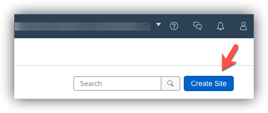
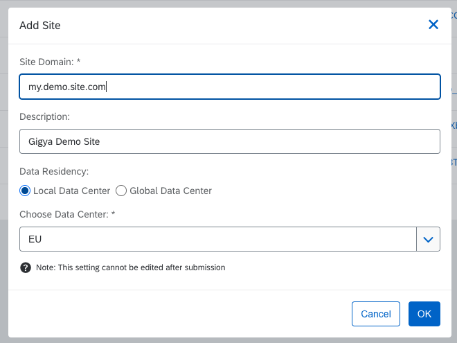
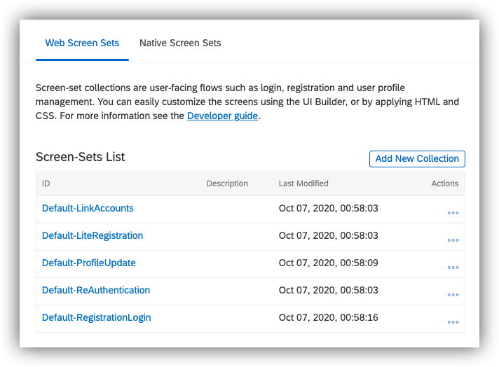

# Installation Guide


## 1. Create site in Gigya console

    (You can skip this step if you already have a site configured and the Api Key ready to use.)

   1. Access your Gigya Console from [https://console.gigya.com]() with your credentials.


   2. If you have site creation capabilities, in the main screen, click on **Create Site**.

   

   3. Add basic data for the site, including **site domain**, **description**, and **datacenter** to be used. Use the nearest one from your location in case of doubts, and click OK.

   


4. Click over Screensets tab to generate a first default set of screensets (starting with **Default-_ScreensetName_**)

    

You're done here.

## 2. Demo app Installation

Now that we have a site in Gigya, we can include it into a web project. To do it:

1. Download / clone the project into your web folder.

    ```
    git clone https://github.com/juanatsap/cdc-html-demo-starter-kit my-gigya-demo-app
    ```

1. Uncomment and change the placeholder **__API_KEY__** inside ```index.html``` file, and comment or remove the example site configured by default.

```
<!-- <script type="text/javascript" lang="javascript" src="https://cdns.gigya.com/js/gigya.js?apikey=__API_KEY__"></script> -->
<script type="text/javascript" lang="javascript" src="https://cdns.gigya.com/js/gigya.js?apikey=3_P6eTVo5EpI6zoB2c1ZgblyCrmx8OMOlrA932HVKEhhHCHwTdUJbBBEpAocpkb_nM"></script>
```


1. Navigate to ```http://localhost/my-gigya-demo-app```

1. Enjoy!
